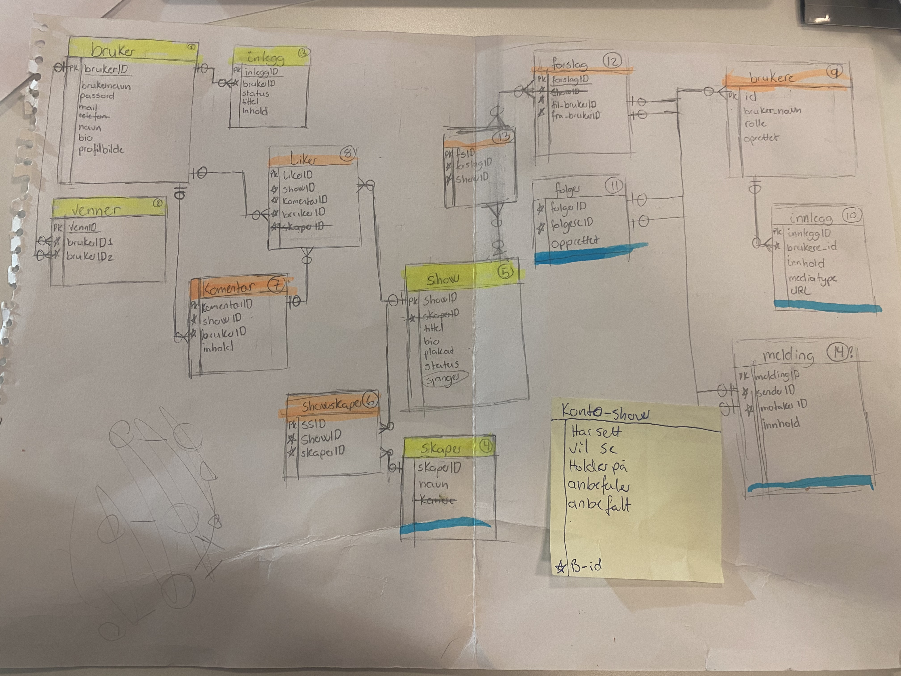
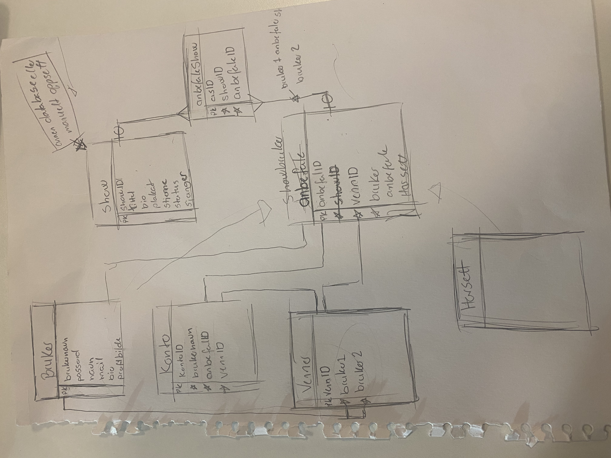
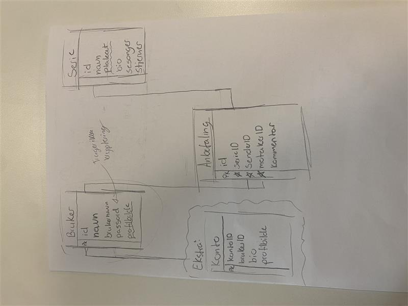
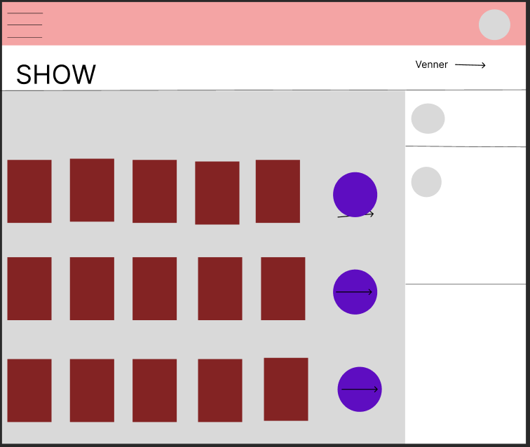
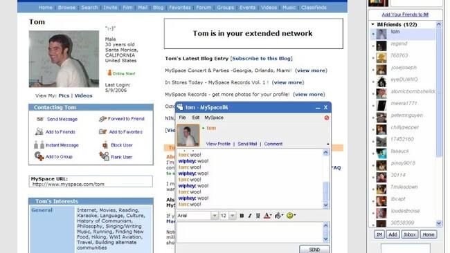

Api
Vidio

# Co-Watch 📺

Co-Watch is a website for friends who want to be able to talk about the same shows, but can't watch them together. Recommend shows to friends, get recommended shows by friends. And if you don't have friends, then you can register what shows you have, want to and curently are watching! 

- [Design Process 🎨](#design-process-🎨)
    - Database
    - Design
- [ Implemented ](#implemented)
    - JS
    - HTML
    - CSS
- [To be implemented](#to-be-implemented)
- [Hope to have](#hope-to-have)

## Development Status 
The project is in active development and is starting to get most of it's basic features. We are still a far ways off from beta, or even alpha testing, but it is moving forward. 

## Design Process 🎨 

### Database
The database started off as a copy of a sosial media database, in other words, it was way to overcomplicated. I ended up redoing it a few times to make it better, and my teacher gave me the base to the finished database. 

I then made it into a propper database using SQLiteStudio.

### Design 
The design of the website was actully quite easy this time. I tried setting it up a bit like a social media platform from the 2000's where the friendlist was on the right side, the bar on the top and the rest taking the space that is left.

## Implemented
On this date, the 5th of Desember 2025, are the following features implimented.

- [x] Define project scope
- [x] Gather requirements
- [x] Create detailed project plan
- [x] You can make an account
- [ ] Hashed passwords
- [ ] Protected websites

- You can make an account.
- You have to have an account to access the website
    - No hashing passwords pr protected websites yet.
- You can se all registerd series
- Your user name is dicplaid at the top of the page.
- You can register a show with a picture as well.
- You can send recommendations to others
- You can recive recommendations from others

## To be implemented

- Sending recommendations is better:
    - You can send by name insted of ID.
    - You can send by clicking on the show and chosing an option.
- Adding/ removing things from a to watch list
- Adding/ removing things from a have watched list
- Adding/ removing things from a curently watching list
- Adding friends and seeing their profiles
- Adding profile picturs and user bios.

        -
- Protected website
- Hashed passwords
- 

## Hope to have 
These are things that I can't impliment for the time being do to either my current skillsett or just lack of time.
* A show API so users don't have to manuely register shows.
* Adding groups, so you can recomend a show to more then one person at a time.

## Tecknology

## How it works/ Functinality

t is curently not in alpha testing do to missing features, but we hope to get it ready for that by feburary. 

